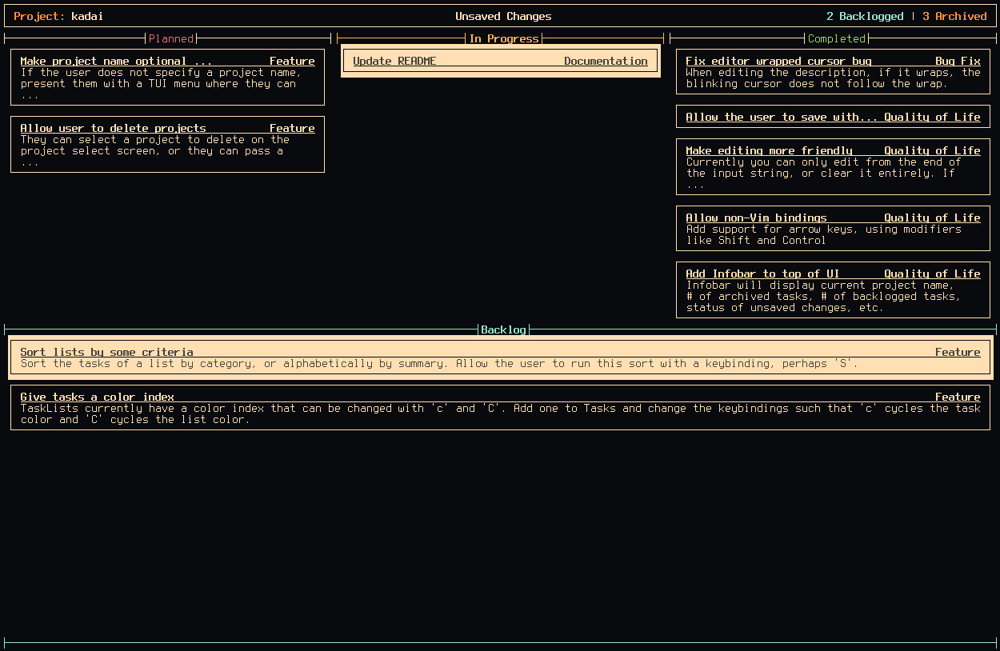

# kadai

A TUI task tracker written in Rust

------------------------------------------------------------------------------



## What is kadai and why does it exist?

_kadai_ is a [kanban-style](https://en.wikipedia.org/wiki/Kanban_(development))
task tracker for the terminal. It tries to be simplistic, but also highly
configurable to whatever project you might be working on.

In the past, I've used my TUI todo-list app
[cascade](https://github.com/Nynergy/cascade) to keep track of tasks for
specific projects. However, this became a hassle, and caused me to use the app
less and less, and sometimes even abandon projects I felt were getting too large
and unwieldy. So I decided to do what I do best: Spend far too much time making
my own in-house solution to a problem already solved by thousands of other
people -- but do it in the terminal with vim-like bindings.

Also I just wanted to use this project as an excuse to learn Rust :)

## What exactly does it do?

It takes a project name on the command line, and creates that project directory
in the user's `~/.kadai` directory if it doesn't already exist. Within each
project directory there are three files: `tracker.json`, `backlog.json`, and
`archive.json`, which is what _kadai_ uses to read and store task data.

The main app interface shows you a horizontal series of user-created lists, and
each list is a vertical column of user-created tasks. Tasks can have a summary,
a description, and a category. You can view and edit task data in the tracker,
as well as edit list titles and colors.

Add new tasks, move them between different lists like stages or states of
progress, and edit their data as you go if need be. There is also a backlog list
where you can stage tasks you aren't ready to place on the tracker yet, and an
archive list where you can store completed tasks that shouldn't be on the
tracker anymore, but also shouldn't be deleted. Of course, you can permanently
delete tasks and lists as you wish.

__Note__: At the moment, _kadai_ will only save project data when it
successfully closes, so if it crashes, you will lose any changes made since last
save.

## How can I compile and run it?

First, you need to clone the repo:

```bash
$ git clone https://github.com/Nynergy/kadai.git
$ cd kadai
```

To build the app and mess around with it, do:

```bash
$ cargo build
$ cargo run <project-name>
```

Where \<project-name\> is just the name of the project directory you want to
create.

To install it into your Cargo installation's install root, do:

```bash
$ cargo install --path .
```

Just be sure that your Cargo install root is in your PATH environment variable,
otherwise your shell won't know where to find the installed binary. Once it's
installed, you can run the app by simply running `kadai <project-name>`.

## How do I use it?

Keybindings for the various interfaces are the following:

#### Tracker

Key | Action
----|-------
<kbd>q</kbd> | save and quit kadai
<kbd>n</kbd> and <kbd>N</kbd> | add new task/list
<kbd>e</kbd> and <kbd>E</kbd> | edit task/list
<kbd>d</kbd> and <kbd>D</kbd> | delete focused task/list
<kbd>j</kbd> and <kbd>k</kbd> | change task focus up and down
<kbd>J</kbd> and <kbd>K</kbd> | move task up and down
<kbd>h</kbd> and <kbd>l</kbd> | change list focus left and right
<kbd>H</kbd> and <kbd>L</kbd> | move list left and right
<kbd>g</kbd> and <kbd>G</kbd> | jump to top or bottom of list
<kbd>c</kbd> and <kbd>C</kbd> | cycle focused list color
<kbd>Space</kbd> and <kbd>Backspace</kbd> | move focused task to next/previous list
<kbd>Enter</kbd> | View focused task details
<kbd>b</kbd> | open backlog popup
<kbd>B</kbd> | move focused task to backlog
<kbd>a</kbd> | open archive popup
<kbd>A</kbd> | move focused task to archive

#### Task Details View

Key | Action
----|-------
<kbd>q</kbd> | save and quit kadai
<kbd>j</kbd> and <kbd>k</kbd> | scroll details up and down
<kbd>Enter</kbd> | exit task details view

#### Backlog Popup

Key | Action
----|-------
<kbd>q</kbd> | save and quit kadai
<kbd>n</kbd> | add new task
<kbd>e</kbd> | edit task
<kbd>d</kbd> | delete focused task
<kbd>j</kbd> and <kbd>k</kbd> | change task focus up and down
<kbd>J</kbd> and <kbd>K</kbd> | move task up and down
<kbd>g</kbd> and <kbd>G</kbd> | jump to top or bottom of list
<kbd>c</kbd> and <kbd>C</kbd> | cycle backlog list color
<kbd>Space</kbd> | move focused task to first list
<kbd>Enter</kbd> | View focused task details
<kbd>b</kbd> | close backlog popup
<kbd>a</kbd> | open archive popup

#### Archive Popup

Key | Action
----|-------
<kbd>q</kbd> | save and quit kadai
<kbd>d</kbd> | delete focused task
<kbd>j</kbd> and <kbd>k</kbd> | change task focus up and down
<kbd>J</kbd> and <kbd>K</kbd> | move task up and down
<kbd>g</kbd> and <kbd>G</kbd> | jump to top or bottom of list
<kbd>c</kbd> and <kbd>C</kbd> | cycle backlog list color
<kbd>Space</kbd> | move focused task to last list
<kbd>Enter</kbd> | View focused task details
<kbd>b</kbd> | open backlog popup
<kbd>a</kbd> | close archive popup

#### Edit/Create Task

Key | Action
----|-------
<kbd>Char</kbd> | enter character into focused input
<kbd>Backspace</kbd> | delete character from focused input
<kbd>Delete</kbd> | clear focused input
<kbd>Tab</kbd> | cycle focused input
<kbd>Enter</kbd> | save task details and close editor
<kbd>Esc</kbd> | close editor

#### Edit/Create List

Key | Action
----|-------
<kbd>Char</kbd> | enter character into focused input
<kbd>Backspace</kbd> | delete character from focused input
<kbd>Delete</kbd> | clear focused input
<kbd>Enter</kbd> | save list details and close editor
<kbd>Esc</kbd> | close editor

## Now what?

Use it, make some stuff, manage projects. Have fun :)
